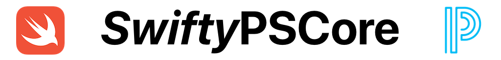

# 

SwiftyPowerSchool is a swift PowerSchool client built to simplify the process of communicating with the PowerSchool API by handling authentication and decoding, allowing you to focus on using the data, not retrieving it.

## Installation

Information coming soon.

## Example Usage
Set environment variables for BASE_URL, CLIENT_ID, and CLIENT_SECRET.

First, instantiate a client:
<pre><code class="swift language-swift">let client = SwiftyPowerSchool(BASE_URL, clientID: CLIENT_ID, clientSecret: CLIENT_SECRET)</code></pre>

Now you can use your client to retrieve:

* Schools
<pre><code class="swift language-swift">client.getSchools() { schools, error in
  if let schools = schools {
    print("Array of schools: \(schools)")
  }
  else {
    print(error?.localizedDescription ?? "Generic error")
  }
}</code></pre>

* Courses
<pre><code class="swift language-swift">client.getCoursesFromSchool(1) { courses, error in
  if let courses = courses {
    print("Array of courses: \(courses)")
  }
  else {
    print(error?.localizedDescription ?? "Generic error")
  }
}</code></pre>

* Sections
<pre><code class="swift language-swift">client.getSectionsFromSchool(3) { sections, error in
  if let sections = sections {
    print("Array of sections: \(sections)")
  }
  else {
    print(error?.localizedDescription ?? "Generic error")
  }
}</code></pre>

* Number of schools
<pre><code class="swift language-swift">client.getSchoolsCount() { schoolsCount, error in
  if let schoolsCount = schoolsCount {
    print("Number of schools: \(schoolsCount)")
  }
  else {
    print(error?.localizedDescription ?? "Generic error 2")
  }
}</code></pre>

## License

SwiftyPowerSchool is released under an MIT license. See [LICENSE](https://opensource.org/licenses/MIT) for more information.
